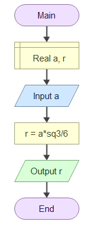

# Домаћи задатак из Техничке документације

## Задатак

Програм који на основу унете дужине **странице** једнакостраничног троугла a израчунава **полупречник уписане кружнице** r.

$r = \frac{a\sqrt{3}}{6}$

### Алгоритамска шема

